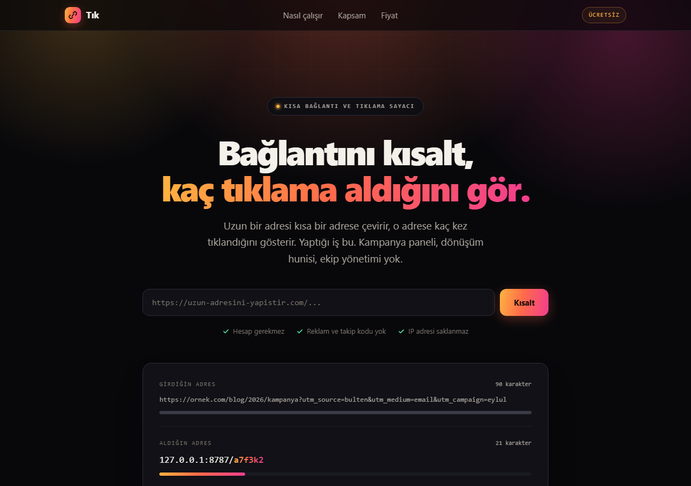

# Tık

Uzun bir bağlantıyı kısaltır ve o bağlantıya kaç kez tıklandığını gösterir.
Yaptığı iş bu. Kampanya paneli, dönüşüm hunisi, ekip yönetimi yok.

Örnek proje.



---

## Şu anki durum

Bu depoda iki parça var ve **ikisi ayrı yerlerde çalışır:**

| Parça | Nerede çalışır | Durum |
|---|---|---|
| Tanıtım sayfası (`public/`) | Her yerde — Vercel, Netlify, GitHub Pages | Statik, bağımlılığı yok |
| Kısaltma servisi (`src/index.js`) | **Yalnızca Cloudflare Workers** | Yerelde test edildi, yayına alınmadı |

**Vercel'e dağıtırsan yalnızca tanıtım sayfası açılır.** Kısaltma formu
"servis bağlı değil" der ve hiçbir şey göndermez — sessizce bozulmaz, ne
olduğunu yazar. Kısa adres yönlendirmesi ve istatistik sayfası da
çalışmaz, çünkü ikisi de sunucu tarafı gerektirir.

Servisin gerçekten çalışması için Cloudflare Workers gerekiyor:
[KURULUM.md](KURULUM.md).

---

## Vercel'e dağıtım (sadece tanıtım sayfası)

Depoyu Vercel'e bağla. `vercel.json` zaten `public/` klasörünü çıktı dizini
olarak işaretliyor, build komutu yok. Ek ayar gerekmiyor.

## Cloudflare'e dağıtım (tam çalışan servis)

```bash
npm install
npx wrangler login
npx wrangler d1 create tik      # çıkan database_id'yi wrangler.toml'a yaz
npm run db:uzak
npx wrangler deploy
```

Ayrıntı ve isteğe bağlı adımlar (zararlı bağlantı kontrolü, bot koruması)
için [KURULUM.md](KURULUM.md).

---

## Ne nerede

| Dosya | İşi |
|---|---|
| `public/index.html` | Tanıtım sayfası ve kısaltma formu |
| `public/istatistik.html` | Tıklama istatistiği ve günlük grafik |
| `src/index.js` | Worker: kısaltma, yönlendirme, istatistik API'si |
| `schema.sql` | D1 tabloları (`links`, `clicks`) |
| `wrangler.toml` | Cloudflare ayarları |
| `vercel.json` | Vercel statik dağıtım ayarı |
| `spec.md` | Kapsam, veri kaynakları, alınan kararlar |
| `KURULUM.md` | Kurulum adımları |

Sayfalar tek dosyadır: harici font, CDN, analitik veya görsel isteği yoktur.

## Anahtarlar

Hiçbir API anahtarı kodda gömülü değildir. Yerelde `.dev.vars`, canlıda
`wrangler secret put` ile verilir. Örnek için `.dev.vars.example` dosyasına bak.

Anahtar tanımlı değilse ilgili kontrol atlanır ve uygulama çalışmaya devam eder.

## Gizlilik

Tıklama sayılırken ziyaretçinin IP adresi saklanmaz; yalnızca ülke kodu
tutulur. Yönlendiren site bilgisi tarayıcı gönderirse kaydedilir,
göndermezse "bilinmiyor" olarak görünür — tahmin üretilmez.

## Eksikler

- Hız sınırı (rate limit) yok
- Eski tıklama kayıtlarını temizleyen bir iş yok
- Kısa alan adı alınmadı; `workers.dev` adresiyle üretilen bağlantı uzun görünür
